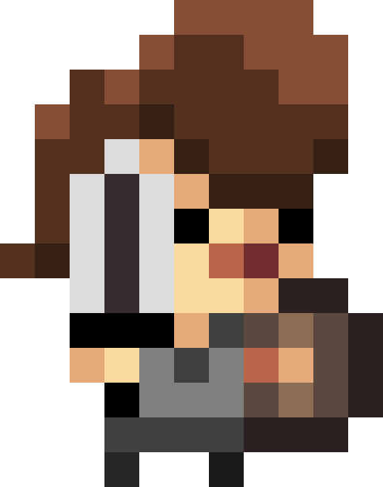

	

---

# TheBocóQuest
Desenvolvido por Isabelle Neves Porto e Tiago Civatti Frausino

---

> ## Sobre
> TheBocóQuest foi desenvolvindo como um projeto de construção de jogos durante o ensino médio no IFSP.  
> Os integrantes do grupo foram: Tiago C. Frausino, Isabelle N. Porto, e Luana Rocha.  
> O jogo foi bem popular entre a turma durante a apresentação, mas o ranking propriamente dito nunca foi divulgado, pois o projeto de criação de jogos foi cancelado devido à reclamação dos alunos :(

 

> ## Como Jogar
> <table border=0>
<tr>
<td></td>
<td>
A D - Andar   
Space - Pular   
S - Defender   
</td>
</tr>
</table>
